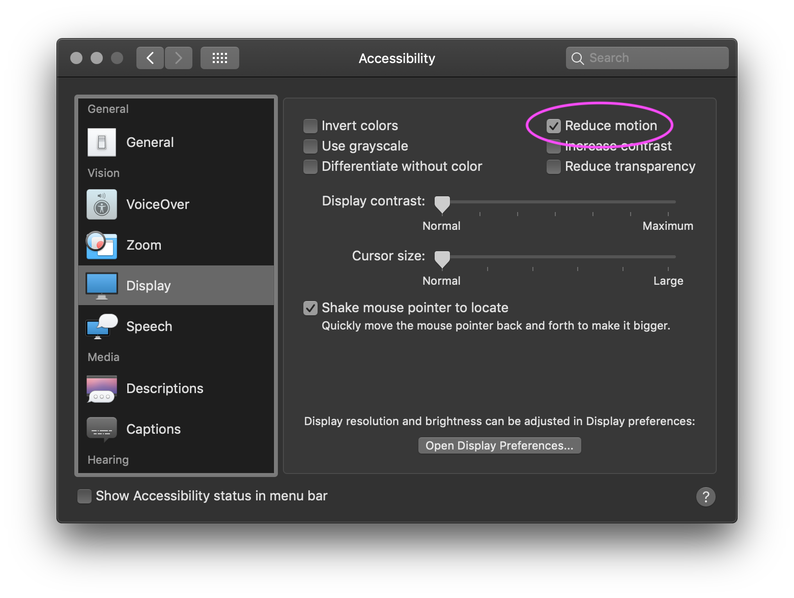

import { useSpring, animated } from 'react-spring';
import { useRect } from '@reach/rect';
import {
  calc,
  transform,
  useReducedMotion,
} from '../../examples/make-it-springy';
import LiveCode from '../../components/live-code';

# It's Springtime in React Town

One joy of web development is its short feedback loop. Change a CSS property: now it’s red! Seeing my work right in the browser, interacting with it, and being able to send it to friends, makes the web a great platform for creative expressions of all kinds. Many powerful new ways to express creativity and personality have sprung up as the web has grown and evolved.

That’s what makes me excited about [react-spring](https://react-spring.io), a way to “bring your components to life with simple spring animation primitives”. React’s declarative programming model has empowered web developers around the world to build predictable, interactive user interfaces and react-spring does the same for animations. If you’ve worked with React, you know it makes handling `state`, data that changes over time, a breeze.

Over the course of this post, I'll show you how react-spring makes working with animations as easy as working with state. Let's dive into some code!

> 💡 All code samples in this post are editable, hack away!

<LiveCode
  code={`function Button() {
  const [active, setActive] = React.useState(false);
  return (
    <button
      className="springy-button"
      onMouseOver={() => setActive(true)}
      onMouseOut={() => setActive(false)}
      style={{
        transform: active ? 'scale(1.2)' : 'scale(1)',
      }}
    >
      Hover over me!
    </button>
  );
}`}
/>

## Code Exploration

To change the `scale` of a button on hover, I create some state:

<LiveCode
  code={`const [active, setActive] = React.useState(false);`}
  disabled
/>

Change that state `onMouseOver` and `onMouseOut` of the button

<LiveCode
  code={`onMouseOver={() => setActive(true)}
onMouseOut={() => setActive(false)}`}
  disabled
/>

And conditionally set the `transform` CSS property on the button `style` based on the `active` state.

<LiveCode
  code={`style={{
  transform: active ? 'scale(1.2)' : 'scale(1)',
}}`}
  disabled
/>

## There's no such Spring as bad publicity

Animating this button is as easy as dropping in a new hook `useSpring` that reacts to the `active` state.

<LiveCode
  scope={{
    useSpring,
    animated,
  }}
  code={`function AnimatedButton() {
  const [active, setActive] = React.useState(false);
  const props = useSpring({
    transform: active ? 'scale(1.2)' : 'scale(1)',
  });
  return (
    <animated.button
      className="springy-button"
      onMouseOver={() => setActive(true)}
      onMouseOut={() => setActive(false)}
      style={{
        transform: props.transform,
      }}
    >
      Hover over me!
    </animated.button>
  );
}`}
/>

There are a couple subtle changes to make this work:

Add the `useSpring` hook and move the CSS properties and conditions inside the object it receives. `useSpring` is imported from `react-spring`

<LiveCode
  code={`const props = useSpring({
  transform: active ? 'scale(1.2)' : 'scale(1)',
});`}
  disabled
/>

Change the `button` element into a `animated.button`. `animated` is imported from react-spring.

<LiveCode
  code={`<animated.button>`}
  disabled
/>

Wire up the "animated" `props` from `useSpring` to our buttons `style` prop.

<LiveCode
  code={`style={{
  transform: props.transform,
}}`}
  disabled
/>

And just like that, you've animated your React Component! The above is a pretty simple animation, though, and **I'd recommend using CSS animations if you're simply looking for a hover interaction**. So, let's look at a more involved animation to see where the power of react-spring really kicks in!

## Spring It On

<LiveCode
  scope={{
    useSpring,
    useRect,
    animated,
    calc,
    transform,
  }}
  code={`function ParallaxAnimatedButton({ rotation = 10, scale = 1.2 }) {
  const buttonRef = React.useRef();
  const [props, set] = useSpring(() => ({
    xys: [0, 0, 1],
    config: { mass: 7, tension: 500, friction: 40 }
  }));
  return (
    <animated.button
      ref={buttonRef}
      className="springy-button"
      onMouseMove={({ clientX, clientY }) =>
        set({ xys: calc(rotation, scale, clientX, clientY, buttonRef.current) })
      }
      onMouseLeave={() => set({ xys: [0, 0, 1] })}
      style={{
        transform: props.xys.to(transform),
      }}
    >
      Hover over me!
    </animated.button>
  );
}`}
/>

> 💡 Try editting the default <code>rotation</code> or <code>scale</code> props' value to a larger number and see what happens!

Let's walk through the changes needed to make this interaction possible:

1. First, you'll notice I got rid of the `active` state. If your hover state only affects style in your render, then consider just using CSS.
2. I setup a refs that will be used in calculating the animated button's size and location. This is necessary for the `calc` function to work. I haven't included that function because, Math. If you want to see it, [check out the source](https://github.com/infiniteluke/lukeherrington.com/blob/master/src/examples/make-it-springy.js).

<LiveCode
  code={`const buttonRef = React.useRef();`}
  disabled
/>

3. Next, I create the spring. It holds an array of the `x` rotation, `y` rotation and the `scale` values for our transform, respectively. I've also configured the spring's dynamics a bit to make the animation more playful and bouncy. You may notice I'm using `useSpring` a bit differently. You can optionally destructure a `set` function for triggering the spring manually.

<LiveCode
  code={`const [props, set] = useSpring(() => ({
  xys: [0, 0, 1],
  config: { mass: 7, tension: 500, friction: 40 }
}));`}
  disabled
/>

4. I then add the `buttonRef` and mouse event handlers to the `animated.button`.

- In `onMouseMove` I recalculate and set the new spring value. The calculation is based on the `rotation` and `scale` props, which control how dramatic the animation is, the `x` and `y` coordinates of the mouse, and the size/location of the button.
- `onMouseLeave` sets the spring back to the initial values.

<LiveCode
  code={`<animated.button
  ref={buttonRef}
  className="springy-button"
  onMouseMove={({ clientX, clientY }) =>
    set({
      xys: calc(
        rotation, // Used to calculate how dramatic the "wobble" effect of the button should be
        scale, // The scale to switch the button should animate to
        clientX, // The mouse's "x" position on the visible screen
        clientY, // The mouse's "y" position on the visible screen
        buttonRef.current, // A reference to the button element to get the offsetX/Y and offsetWidth/Height
      )
    })
  }
  onMouseLeave={() => set({ xys: [0, 0, 1] })}
>
 `}
  disabled
/>

5. Finally, the `transform` style is set on the button using the springs `to` function which allows me to transform the spring values into the CSS rotations/scale. ex: `transform: perspective(800px) rotateX(10deg) rotateY(-10deg) scale(1.2)`.

<LiveCode
  code={`transform: props.xys.to(transform)`}
  disabled
/>

## Too much of a good Spring

As you can see, things can get out of hand quite quickly when it comes to animation! react-spring is super powerful. With a couple of hooks, some creativity, and a little math, we made a fun interactive button. But with great power, comes great responsibility.

When building animations, it's tempting to put them everywhere and make them extra "springy". However, consider the different kinds of users that may use your site.

Vestibular dysfunction, a balance disorder of the inner ear, is surprisingly common among US adults. [A study](https://www.ncbi.nlm.nih.gov/pubmed/19468085) from the early 2000's found that approximately 69 million Americans had vestibular dysfunction which results in vertigo, nausea, migraines and hearing loss. Many people affected by vestibular dysfunction will choose to set the "Reduce motion" setting in their OS. In macOS it's found in the accessibility settings.

To avoid making your users sick, consider using the `prefers-reduced-motion` [media query](https://developer.mozilla.org/en-US/docs/Web/CSS/@media/prefers-reduced-motion) to disable or lessen animations in your app. I even made a hook out of it:

<LiveCode
  code={`const useReducedMotion = () => {
  const [matches, setMatch] = React.useState(false)
  React.useEffect(() => {
    const mediaQuery = window.matchMedia('(prefers-reduced-motion: reduce)');
    setMatch(mediaQuery.matches);
    const handleChange = () => {
      setMatch(mediaQuery.matches)
    }
    mediaQuery.addEventListener('change', handleChange);
    return () => {
      mediaQuery.removeEventListener('change', handleChange)
    }
  }, []);
  return matches;
}`}
  disabled
/>

> 🔥 I turned this into a library called <a href="https://github.com/infiniteluke/react-reduce-motion">react-reduce-motion</a>. It implements <code>useReducedMotion</code> for web and react native. It'll be on NPM soon.

To use the hook, you can call it at the top of your function component, and use its return value to decide if to apply the animation or the default style.

> 💡 If your OS supports "Reduce motion", try enabling it and interacting with the button below:

<LiveCode
  scope={{
    useSpring,
    useRect,
    animated,
    calc,
    transform,
    useReducedMotion,
  }}
  code={`function ParallaxAnimatedButton({ rotation = 10, scale = 1.2 }) {
  const buttonRef = React.useRef();
  const reduceMotion = useReducedMotion();
  const defaultTransform = [0, 0, 1]
  const actualRotation = reduceMotion ? rotation / 3 : rotation;
  const actualScale = reduceMotion ? 1.01 : scale;
  const [props, set] = useSpring(() => ({
    xys: defaultTransform,
    config: { mass: 7, tension: 500, friction: 40 }
  }));
  return (
    <animated.button
      ref={buttonRef}
      className="springy-button"
      onMouseMove={({ clientX, clientY }) =>
        set({ xys: calc(actualRotation, actualScale, clientX, clientY, buttonRef.current) })
      }
      onMouseLeave={() => set({ xys: defaultTransform })}
      style={{
        transform: props.xys.to(transform),
      }}
    >
      Hover over me!
    </animated.button>
  );
}`}
/>

> 💡 You could also skip animations all together by setting the <code>skipAnimation</code> Global in react-spring:

<LiveCode
  code={`import {Globals} from 'react-spring'
const MyApp = () => {
  const prefersReducedMotion = useReducedMotion()
  React.useEffect(() => {
    Globals.assign({
      skipAnimation: prefersReducedMotion,
    })
  }, [prefersReducedMotion])
  return ...
}`}
  disabled
/>

## All good Springs come to and end

I'm really excited about react-spring. With very little code, you can add a bit of personality to your app. But, as always, it's imperative that accessibility doesn't suffer for the sake of "cool" interactions. react-spring could bake an accessibility solution into the library by allowing a config option or [shipping the above hook](https://github.com/react-spring/react-spring/issues/811) to help devs respect the reduce motion media query. Until then, it's on you to make sure your app is usable by everyone!

So, go make your app springy with react-spring! But not _too_ springy... 😉
